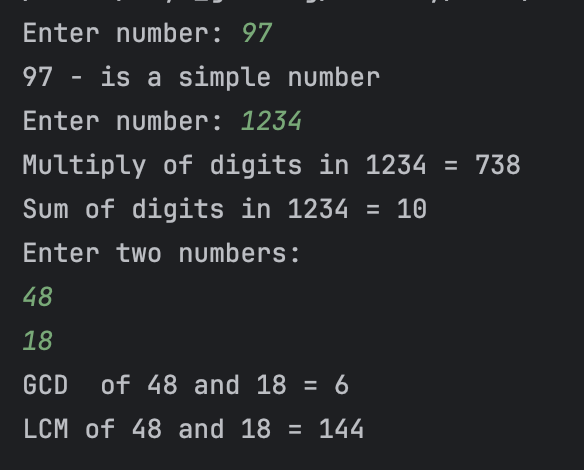

# Задания.
## Задание 1. 
Пользователь вводит число, необходимо определить, является ли введенное число простым 
(https://ru.wikipedia.org/wiki/%D0%9F%D1%80%D0%BE%D1%81%D1%82%D0%BE%D0%B5_%D1%87%D0%B8%D1%81%D0%BB%D0%BE).
## Задание 2.
Пользователь вводит целое число (любое длины, int). Программа должна посчитать сумму и 
произведение цифр данного числа.
## Задание 3.
Пользователь вводит 2 числа. Необходимо найти НОК и НОД двух этих чисел.

---

> Примечание:
> При реализации заданий можно выполнять декомпозицию на процедуры (можно каждое задание
> сделать при этом в отдельной процедуре). Процедурная парадигма в Java реализуется нами
> на данный момент через статические методы класса Main.

